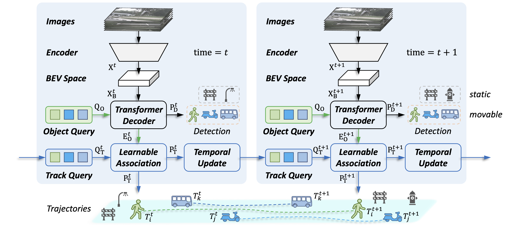

[](LICENSE)
# End-to-end 3D Tracking with Decoupled Queries

<div align="center">
  
</div><br/>


This project provides an implementation for the ICCV 2023 paper "[End-to-end 3D Tracking with Decoupled Queries](https://openaccess.thecvf.com/content/ICCV2023/papers/Li_End-to-end_3D_Tracking_with_Decoupled_Queries_ICCV_2023_paper.pdf)" based on [mmDetection3D](https://github.com/open-mmlab/mmdetection3d).
In this work, we propose a simple yet effective framework for 3D object tracking, termed DQTrack. Specifically, it utilizes decoupled queries to address the task conflict representation in previous query-based approaches.
With the designed task-specific queries, DQTrack enhances the query capability while maintaining a compact tracking pipeline.

## Setup
This project is based on [mmDetection3D](https://github.com/open-mmlab/mmdetection3d), which can be constructed as follows.

1. Download and install `mmdet3d` (v1.0.0rc3) from the official repo.

```bash
git clone --branch v1.0.0rc3 https://github.com/open-mmlab/mmdetection3d.git
```

2. Our model is tested with `torch 1.13.1`, `mmcv-full 1.4.0`, and `mmdet 2.24.0`. You can install them by
```bash
pip3 install torch==1.13.1 mmcv-full==1.4.0 mmdet==2.24.0
```

3. Install mmdet3d following `mmdetection3d/docs/en/getting_started.md`. 

4. To avoid potential error in MOT evaluation, please make sure `motmetrics<=1.1.3`.

5. Copy our project and related files to installed mmDetection3D:
```bash
cp -r projects mmdetection3d/
cp -r extra_tools mmdetection3d/
```

6. (Optional) Compile and install essential `VoxelPooling` if you want to use stereo-based network.

```bash
python3 extra_tools/setup.py develop
```

## Data Preparation
Please prepare the data and download the preprocessed info as follows:

1. Download nuScenes 3D detection data [HERE](https://www.nuscenes.org/download) and unzip all zip files.

2. Like the general way to prepare dataset, it is recommended to symlink the dataset root to `mmdetection3d/data`.

3. Download pretrained models & infos [HERE](https://drive.google.com/file/d/1mD4KQGxUgB20HSD1ML-4Y_-TAOxSsktz/view?usp=sharing) and move the downloaded info and models to `mmdetection3d/data/infos` and `mmdetection3d/ckpts`.

The folder structure should be organized as follows before our processing.

```
mmdetection3d
├── mmdet3d
├── tools
├── configs
├── extra_tools
├── projects
├── ckpts
│   ├── model_val
│   ├── pretrain
├── data
│   ├── nuscenes
│   │   ├── maps
│   │   ├── samples
│   │   ├── sweeps
│   │   ├── v1.0-test
│   │   ├── v1.0-trainval
│   ├── infos
│   │   ├── track_cat_10_infos_train.pkl
│   │   ├── track_cat_10_infos_val.pkl
│   │   ├── track_test_cat_10_infos_test.pkl
│   │   ├── mmdet3d_nuscenes_30f_infos_train.pkl
│   │   ├── mmdet3d_nuscenes_30f_infos_val.pkl
│   │   ├── mmdet3d_nuscenes_30f_infos_test.pkl
```


## Training
You can train the model following [the instructions](https://github.com/open-mmlab/mmdetection3d/blob/v1.0.0rc3/docs/en/datasets/nuscenes_det.md).
You can find the pretrained models [HERE](https://drive.google.com/file/d/1mD4KQGxUgB20HSD1ML-4Y_-TAOxSsktz/view?usp=sharing) if you want to train the model.
If you want to train the detector and tracker in an end-to-end manner from scratch, please turn the parameter `train_track_only` in config file to `False`.

For example, to launch DQTrack training on multi GPUs,
one should execute:
```bash
cd /path/to/mmdetection3d
bash extra_tools/dist_train.sh ${CFG_FILE} ${NUM_GPUS}
```
or train with a single GPU:
```bash
python3 extra_tools/train.py ${CFG_FILE}
```

## Evaluation
You can evaluate the model following [the instructions](https://github.com/open-mmlab/mmdetection3d/blob/v1.0.0rc3/docs/en/getting_started.md).

ATTENTION: Because the sequential property of data, only the single GPU evaluation manner is supported:
```bash
python3 extra_tools/test.py ${CFG_FILE} ${CKPT} --eval=bbox
```

## Model and Results
We provide results on nuScenes *val* set with pretrained models. All the models can be founded in `model_val` of [HERE](https://drive.google.com/file/d/1mD4KQGxUgB20HSD1ML-4Y_-TAOxSsktz/view?usp=sharing).

|                                             | Encoder | Decoder | Resolution | AMOTA | AMOTP |
|---------------------------------------------|:-------:|:-------:|:----------:|:-----:|:-----:|
|[DQTrack-DETR3D](projects/configs/dqtrack/detr3d_r101_size_900_1600_dq.py)| R101 | DETR3D | 900x1600 | 36.7% | 1.351 |
|[DQTrack-UVTR](projects/configs/dqtrack/uvtr_r101_size_900_1600_dq.py)| R101 | UVTR-C | 900x1600 | 39.6% | 1.310 |
|[DQTrack-Stereo](projects/configs/dqtrack/bevstereo_r50_fb3_size_512_1408_dq.py)| R50 | Stereo | 512x1408 | 36.9% | 1.371 |
|[DQTrack-Stereo](projects/configs/dqtrack/bevstereo_r101_fb3_size_512_1408_dq.py)| R101 | Stereo | 512x1408 | 40.7% | 1.317 |
|[DQTrack-PETRV2](projects/configs/dqtrack/petrv2_vov99_fb3_320_800_dq.py)| V2-99 | PETRV2 | 320x800 | 44.4% | 1.252 |

## LICENSE

Copyright © 2023, NVIDIA Corporation. All rights reserved.

This work is made available under the Nvidia Source Code License-NC. Click here to view a copy of this license.

The pre-trained models are shared under CC-BY-NC-SA-4.0. If you remix, transform, or build upon the material, you must distribute your contributions under the same license as the original.

For business inquiries, please visit our website and submit the form: [NVIDIA Research Licensing](https://www.nvidia.com/en-us/research/inquiries/)

## Citation
If this work is helpful for your research, please consider citing:

```
@inproceedings{li2023end,
  title={End-to-end 3D Tracking with Decoupled Queries},
  author={Li, Yanwei and Yu, Zhiding and Philion, Jonah and Anandkumar, Anima and Fidler, Sanja and Jia, Jiaya and Alvarez, Jose},
  booktitle={IEEE/CVF International Conference on Computer Vision (ICCV)},
  year={2023}
}
```

## Acknowledgement
We would like to thank the authors of [DETR3D](https://github.com/WangYueFt/detr3d), [MUTR3D](https://github.com/a1600012888/MUTR3D), [UVTR](https://github.com/dvlab-research/UVTR), [PETR](https://github.com/megvii-research/PETR), and [BEVStereo](https://github.com/Megvii-BaseDetection/BEVStereo) for their open-source release.
